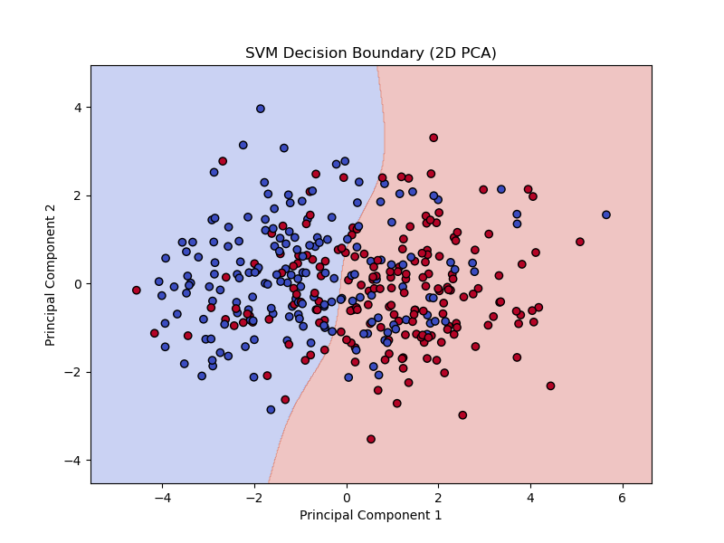
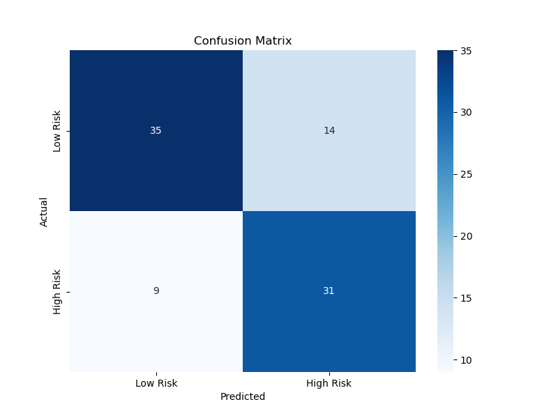
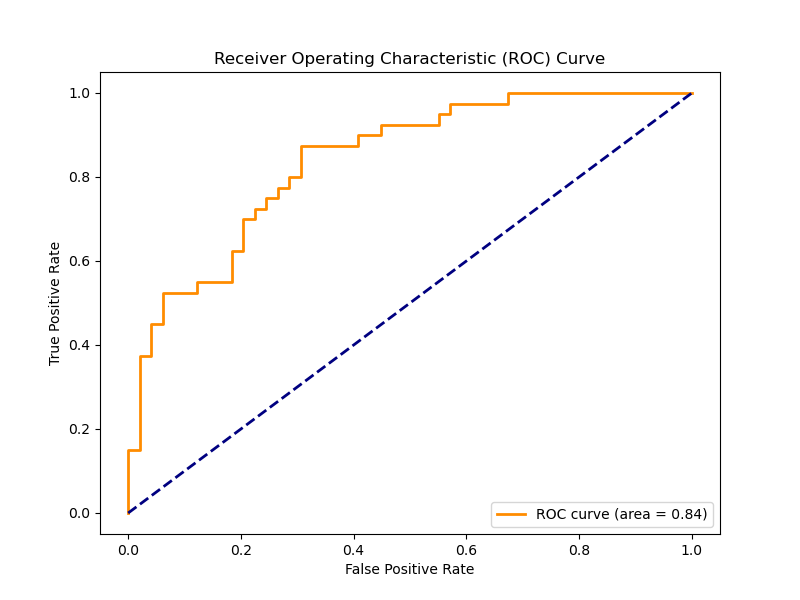

# Diabetes Risk Prediction using SVM

### 🚀 Overview
This project uses Machine Learning to classify individuals into "Low Risk" or "High Risk" categories for diabetes based on clinical features. It achieves an accuracy of ~74% using a Support Vector Machine (SVM) classifier.

### 🧠 Methodology
- **Dataset:** Scikit-learn Diabetes dataset.
- **Preprocessing:** Feature scaling using `StandardScaler`.
- **Dimensionality Reduction:** PCA used for visualization of decision boundaries.
- **Model:** SVM with RBF (Radial Basis Function) kernel.

### 📊 Performance
- **Accuracy:** 74.15%
- **AUC-ROC Score:** 0.82
- **Key Metrics:** High recall for "High Risk" class (0.78), ensuring fewer cases go undetected.

### 🖼 Visualizations
- **Confusion Matrix:** Displays true positives vs. false negatives.
- **ROC Curve:** Illustrates the diagnostic ability of the classifier.
- **Decision Boundary:** Shows how the SVM separates the classes in a 2D space.

### 🛠 Tech Stack
- Python, Scikit-learn, Pandas, NumPy
- Matplotlib, Seaborn
- ### 📊 Visualizing the Results

| Decision Boundary | Confusion Matrix |
| :---: | :---: |
|  |  |

| ROC Curve | 
| :---: |
|  |
